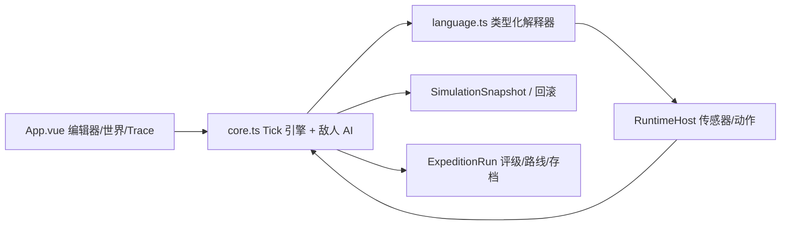

# CodeRogue 课程答辩材料

> 定位：一个“写代码即玩法”的编程 Roguelite。玩家为机器人编写受限 C++ 风格固件，程序直接决定生存、评级与奖励。
> 一句话：这不是“学完再玩游戏”，而是“用代码解决眼前每一个随机关卡”。

## 1. 演示前必知

```bash
npm install
npm run dev      # 启动游戏
npm run build    # 生产构建
npm test         # 72 个自动化测试
```

## 2. 项目要解决什么问题

- 编程教育常把“语法练习”和“游戏”分开；玩家抄代码，而不是用代码决策。
- Roguelite 常见问题是“数值随机”但没有真正的策略深度。
- CodeRogue 的答案：让每一场远征的敌人、禁手、路线、评级都由“玩家写的固件”决定。

## 3. 答辩时讲的三条创新点

1. 受限但真实的 RoboC++ 运行时
   - 手写 Lexer → Parser → AST → 类型化解释器，不用 eval/编译器。
   - 持久全局变量、bool/int、数组、用户函数、短路逻辑、运行预算与安全错误定位。
   - 为“游戏内可写代码”提供了可验证、可回放、可调试的确定性底座。

2. 代码即胜负，而不是按钮
   - 普通战斗禁用近战、BOSS 禁用远程、精英会在“远程/贴脸”之间轮换。
   - 评级由无伤/速度/能耗/动作纪律/感知节奏拆解，直接映射模块或应急资源。
   - “载入参考解”被限制为每局一次，杜绝一键通关。

3. 面向复现与公平的 Roguelite 工程
   - 种子可复制、路线 7-10 节点、分岔/整备/商店/事件齐全。
   - 用 100 个种子的无 meta 自动玩家在“保守/精英捷径”两条路线上全通，作为公平性回归。
   - 中途退出与自动演示不再结算永久资源，防止刷分漏洞。

## 4. 系统架构（讲解用）

- `src/language.ts`：词法/语法/类型化解释器、运行预算、源码行列错误。
- `src/core.ts`：确定性 Tick 引擎、敌人 AI、路线/远征/评级/存档。
- `src/App.vue`：编辑器、地图、Trace、调试器、远征界面。
- `tests/`：语言、核心、自动演示、公平性与反通用代码回归。

关键设计约束：游戏规则不在 Vue 组件里，状态可快照/回滚；同一套模拟同时服务 Story 教学与 Expedition 远征。



## 5. 验收证据（可直接展示）

| 维度 | 证据 |
| --- | --- |
| 构建 | `npm run build` 通过 |
| 自动化 | `npm test`：72 个测试通过 |
| 教学 | 7 个 Story 关卡，覆盖 if/状态/远程/护盾 |
| 语言 | 数组/循环/函数/类型检查/短路/除法零错误定位 |
| 调试 | Trace、断点、监视点、快照回滚、失败 Core Dump |
| 远征 | combat/elite/event/shop/rest/branch/boss，7-10 节点 |
| 公平性 | 保守与精英捷径各 100 个种子新鲜局全通 |
| 反一键通关 | 草稿≠答案、参考解每局限一次、禁手约束 |
| 元进度 | Story 评级、远征履历、可购买机体升级、种子复制 |

## 6. 迭代记录（证明不是一次成型）

`ROGUE_REDESIGN.md` 记录了 29 轮分析/开发：从“一份固件通吃”漏洞开始，逐步加入评级、公平性、参考解限制、草稿完整性、路线分岔与跨局经济封口。每一轮都伴随 `npm test` 与 `npm run build`。

## 7. 10 分钟演示脚本（建议）

1. 0:00-1:30 打开 Story，跑 0-1，解释 update/动作/每拍一个动作。
2. 1:30-3:00 演示 Trace：指出传感器、变量、动作回放如何帮助改代码。
3. 3:00-4:30 进入远征第一战，展示“需要 ranged_attack/禁止 attack”的约束提示；故意用旧固件让它构建失败。
4. 4:30-6:30 补全固件通关，展示评分卡（无伤/速度/能耗等）与模块直接奖励。
5. 6:30-8:00 走到分岔：选精英捷径，遇到“贴脸拆塔”，用近战固件通关。
6. 8:00-9:00 展示设置中的远征履历、Story 最佳评级与机体升级。
7. 9:00-10:00 打开 `npm test` 现场跑一遍，作为工程可信度收尾。

## 8. 评委可能问的问题与回答

Q：为什么不用现成语言？
A：现成语言无法在浏览器里安全限制 API、类型、循环边界与源码行列；手写运行时让“传感器/动作”成为语言原生能力，也让约束（禁 ranged_attack）成为构建期规则。

Q：它比 Zachtronics/编程教学游戏难在哪？
A：难在“运行后可回放的确定性 + 关卡数据驱动 + Roguelite 经济”三者耦合；代码与敌人 AI 共享同一 Tick 引擎，因此玩家写的程序会被真实敌人压力测试。

Q：游戏是否过于简单/有漏洞？
A：这是重点迭代方向。通过禁手约束、草稿完整性、参考解每局限一次、刷分封口和 100 种子公平性回归，把“一键通关”漏洞逐项关闭；剩余挑战是内容量与模块语义深度。

## 9. 已知不足（主动承认比被追问更好）

- 远征同一类型代码仍偏模板化，算法深度有待扩展。
- 事件/商店目前是菜单决策，还不是代码决策。
- 模块多数仍是数值型，行为型模块只有雏形（声呐范围等）。

后续路线已在文档中：普通战斗随机禁手、更多敌人行为、行为型构筑、按节点复盘。

## 10. 结论

CodeRogue 完成了一个可玩、可复现、可测试的编程 Roguelite 纵切片：解释器真实、代码即胜负、远征公平、有元成长，并有 72 个测试与 100 种子公平性验证支撑“工程可信”。