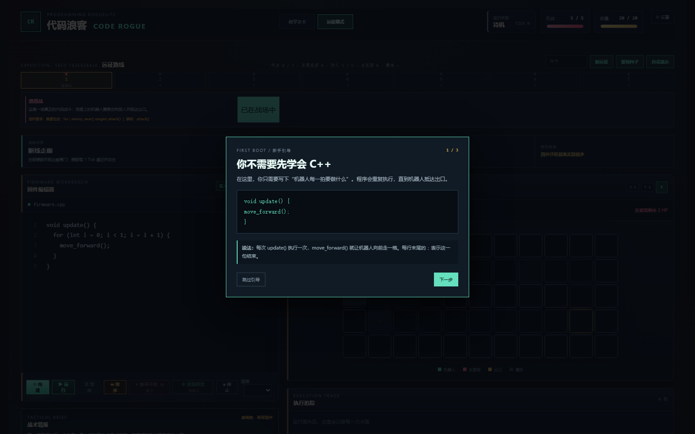
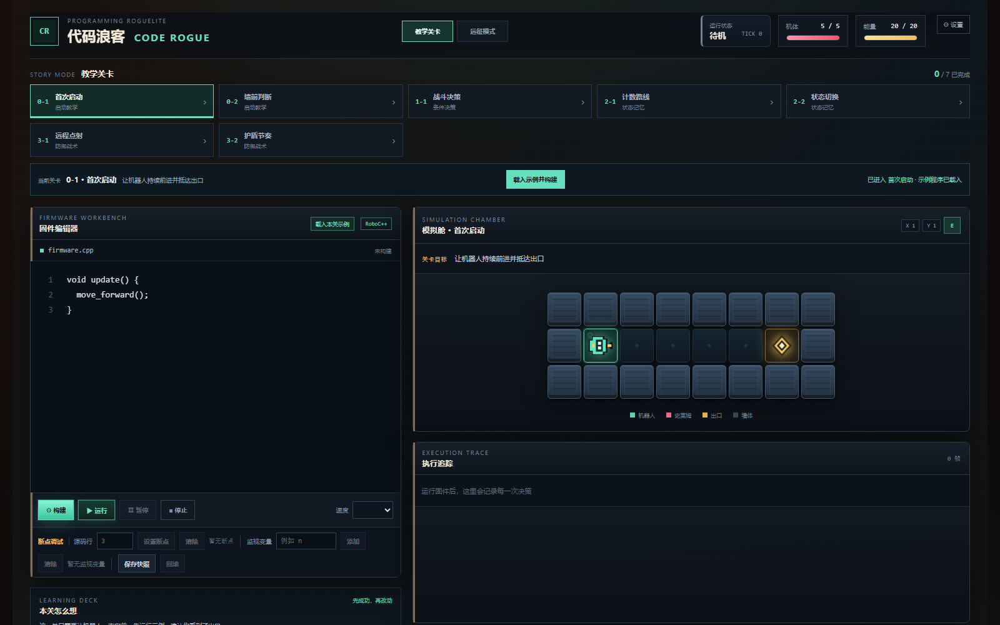
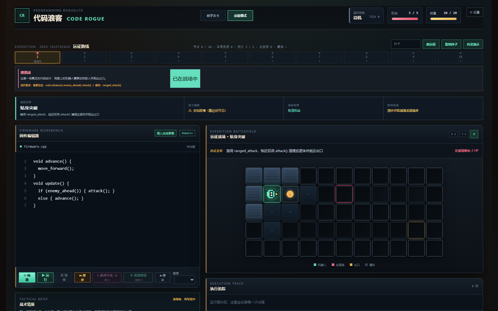

# CodeRogue

CodeRogue is a browser programming roguelite. Write a small C/C++-style RoboC++ firmware, build it, and watch a robot execute one world action per tick.

## Run

```bash
npm install
npm run dev
```

`BUILD` validates the restricted language. `RUN` starts the deterministic tutorial simulation. The Trace Replay panel explains sensor reads, state, and the committed action for every tick.

## Playable Demo Flow

1. Dismiss the first-launch tutorial, choose any of the seven freely selectable Story levels, and edit `update()` in the firmware editor.
2. Press **构建** to validate RoboC++; press **运行** to execute one world action per tick.
3. Inspect the map and Trace Replay, then use breakpoints, watchpoints, snapshots, and rollback to debug behavior.
4. Complete a level, or try the seeded Expedition route: choose a node action, inspect the deterministic outcome, then select one of three API/Sensor/Runtime/Debugger rewards through the BOSS node.

The current release includes strict runtime validation, persistent typed state, bounded loops, fixed-size arrays, user functions, combat, deterministic debugging, Chinese responsive UI, tutorial guidance, optional audio feedback, local firmware/settings history, and a 7-10 node Expedition vertical slice with branch, rest, and boss decisions.

## Course / Defense
For course defense materials, demo script, and judge Q&A, see `DEFENSE.md`.

## Verification

`npm test` and `npm run build` are the release checks. The seven Story maps have automated solvability strategies and are regression-tested after runtime changes.

## UI Preview




